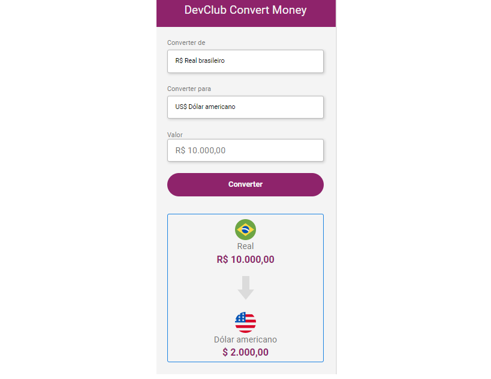

# :triangular_flag_on_post: Projeto - Currencyconvert
Para ver o projeto ao vivo, [Clique aqui](https://cibell.github.io/currencyconvert/)


# :speech_balloon: Sobre

Esse projeto foi realizado dentro da platafomar do DevClub, formação de Full Stack do desenvolvedor **Rodolfo mori**, com o objetivo de converter Real para moedas (euro, dolar e bitcoin) em tempo real consumindo Api Rest e de colocar em praticar conhecimento adiquirido em: **HTML, CSS e JavaScripts**. O desafio foi colocar para converter em bitcoin.

### Aprendizados:
- Html: select, input e button.
- Css: posicionamento de elementos.
- JavaScripts: utilizando const e arrow function.
- Api: rota do tipo Get 

### Pré-requisitos"

 Antes de iniciar você precisa ter o [VSCode](https://code.visualstudio.com/), [Git](https://git-scm.com) e [Node.js](https://nodejs.org/en/) instalados no computador.


# :computer: Tecnologias

- [JavaScript](https://developer.mozilla.org/pt-BR/docs/Web/JavaScript) 
- [Html](https://developer.mozilla.org/pt-BR/docs/Web/HTML/Element/html/)  
- [CSS](https://developer.mozilla.org/pt-BR/docs/Web/CSS)

## :checkered_flag: Iniciando ##

```bash
# Clone this project
$ git clone https://github.com/Cibell/currencyconvert.git
# Access
$ No arquivo Html, você clicar com botão direito do mouse e vai em live server
```


# :closed_book: Licença

Lançado em 2022. Este projeto está sob a <br>
Made with love by [Cibele Cordeiro](https://github.com/Cibell) 💜🚀
